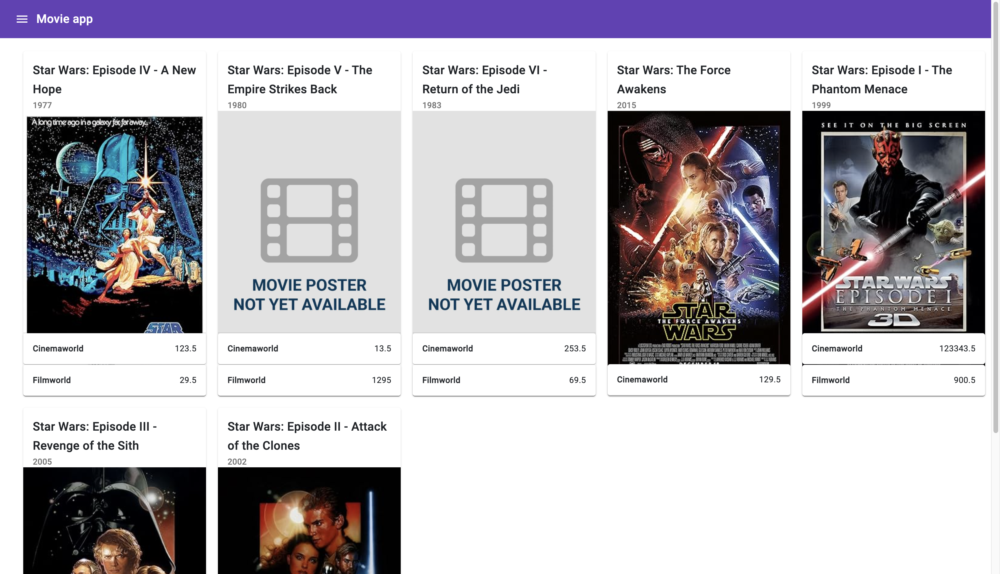

# MovieApp

Welcome to the Movie App! This application allows users to browse and view details about movies from different providers. Currently we have two prividers **cinemaworld** and **filmworld**. The app enable user to get the cheapest price for movies from these two providers in a timely manner.

The Movie application's web interface is hosted on Netlify, accessible via the following link: [MovieApp](https://65ce0e9eb58a78071c7ded32--lucky-naiad-10e2f2.netlify.app/)

The backend code has been containerized using Docker and deployed automatically on the fly.io platform.

This setup segregates the frontend and backend components of the application, allowing for efficient management and scaling of resources. The frontend resides on Netlify, ensuring reliable access for users, while the backend logic is encapsulated within Docker containers and deployed on fly.io, providing flexibility and ease of deployment.

By adopting this architecture, the application benefits from a decoupled design, facilitating independent scaling and maintenance of frontend and backend services.



## Features

- Browse a list of movies from various providers.
- Price matching of movies across various providers.

#### Potential improvements for when there is a greater variety of movies and additional providers available
- Filter movies by provider and genre
- Search for movies by title, genre, or keyword.

## Highlights

The getMovies function may not always return the movie list reliably due to potential issues with the real-world API. Therefore,

1. a retry mechanism has been implemented to recall the real-world API in case it returns an unsuccessful response code.
2. Movies from both providers are fetched asynchronously using Task.WhenAll.

The getPrice API retrieves the price attribute from the getMovieDetail API. However, due to potential unreliability in obtaining the required detail from getMovieDetail, we have implemented

1. a retry mechanism. This mechanism allows the getPrice API to be recalled up to three times, ensuring that the API returns the price if it exists.

## Technologies Used

- .NET Core (Version: 8.0.1)
- C# Programming Language
- ASP.NET Core MVC for building web applications
- Angular for frontend development (Angular16)
- NodeJs (node v18.19.0)

## Step by step to run the server locally

### Step1: Navigate to the API directory

```bash
cd /API
```

### Step2: Install dependencies

```bash
dotnet restore
```

### Step3: Run the application

```bash
dotnet run
```

### Step4： Open your web browser and navigate to `https://localhost:5001` to view the application

There are three APIs

- GetMovies: /movies
  : This API consolidates movies from Cinemaworld and Filmworld providers. Movie IDs, such as 'cw0076759' and 'fw0076759', are considered equivalent.

- GetMovieDetails: /movie/{provider}/{movieID}
  : This API retrieves movie details based on the specified provider name and movie ID

- GetMoviePrice: /movie/{movieID}/price
  : This API returns the price of the movie

## Step by step to run the client locally

### Step1: Install Node.js and npm

### Step2: Install Angular CLI

```
npm install -g @angular/cli
```

### Step3: Install Project Dependencies

```
npm install
```

### Step4: Run the Angular Development Server

```
ng serve

```

### Step5: Once the server is running, open your web browser and navigate to `http://localhost:4200/` (or the specified URL if you have customized it). You should see your Angular application running.
